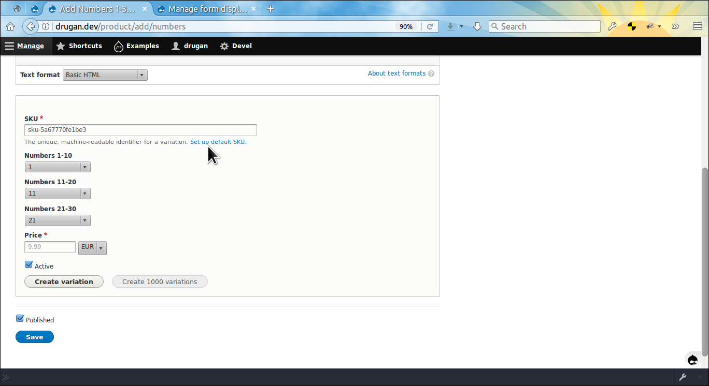
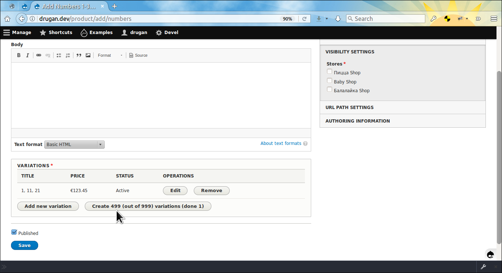
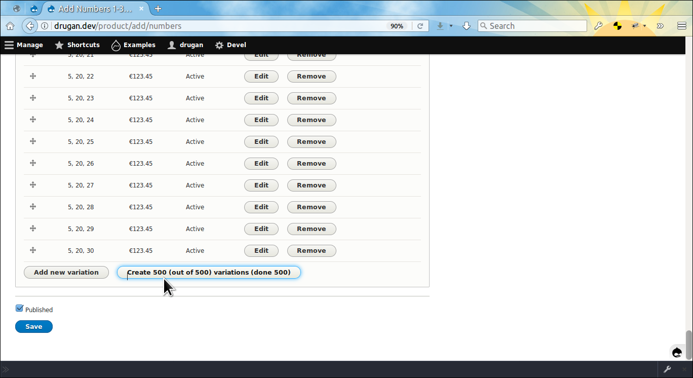
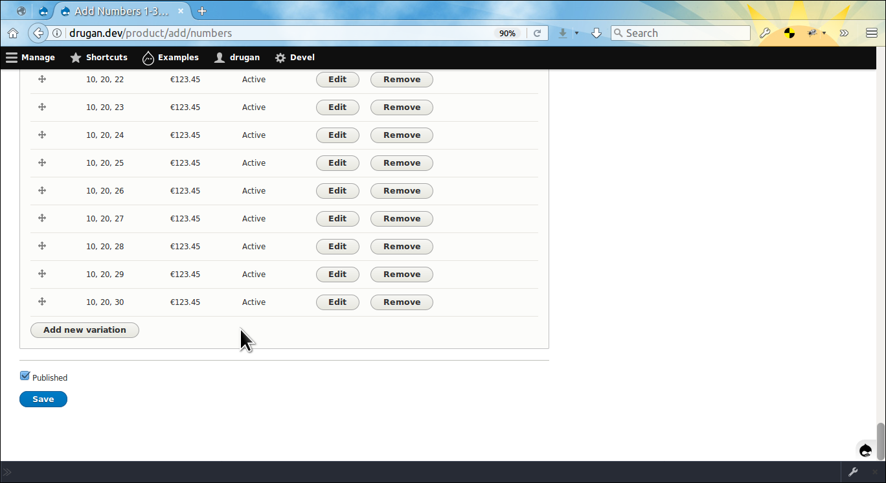
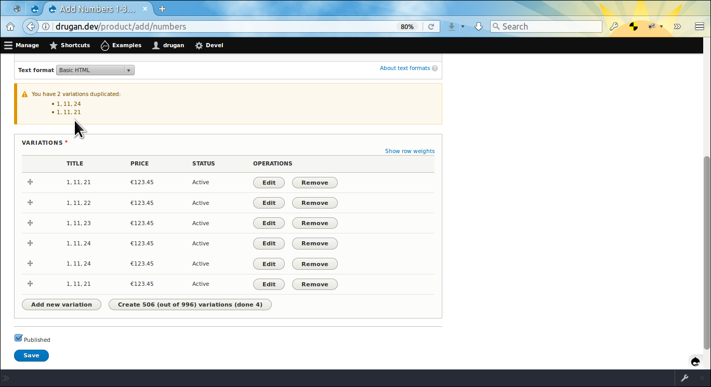

Commerce Bulk
=============

Provides a service for bulk creation of *Drupal Commerce* entities. For now just
product variations could be bulk created on a product add or edit form. Also,
dummy products could be bulk generated if
the [Commerce Generate ↗](https://github.com/drugan/commerce_bulk/tree/8.x-1.x/modules/commerce_generate)
submodule is enabled.

> Tip: you can see this file in your browser by clicking
the [admin/help#](#0 "? Help") link at the right of the *Admin toolbar* and then
the [admin/help/commerce_bulk#](#0 "Commerce Bulk") link in the list.

The module was created as a solution for the following *Drupal Commerce* issue:

[Issue \#2755529: Product variant bulk creation ↗](https://www.drupal.org/node/2755529)

________________________________________________________________________________

- [admin/help/commerce_bulk#info-for-developers](#info-for-developers "Info for developers")
- [admin/help/commerce_bulk#todo](#todo "TODO")
- [admin/help/commerce_bulk#module-author](#module-author "Module author")
- [Commerce Bulk on drupal.org ↗](https://www.drupal.org/project/commerce_bulk)
- [Commerce Bulk on github.com ↗](https://github.com/drugan/commerce_bulk)

________________________________________________________________________________

After installing the module go to a product variation
type *Manage form display* tab and check your settings for
the *Commerce Bulk SKU* widget. As an example
the [admin/commerce/config/product-variation-types/default/edit/form-display#](#0
"default product variation type") is taken but actually all of the types should
have the widget enabled by default.


The *SKU* widget settings' summary explained:

- **size:** The size of the *SKU* field on a variation add / edit form.
- **placeholder:** The text appearing inside the empty *SKU* field.
- **maximum:** The maximum of *SKU* values that might be generated in one go.
Use it to restrict the number of variations to create by pressing
the `Create N variations` button. So, to create the next portion of variations
the button should be pressed once more and more, etc..
- **custom_label:** Set a custom label for the field as the
default *"SKU"* text for the label might be seen as confusing by some people.
- **hide:** Whether to hide the *SKU* field on a variation add / edit form. Note
that, despite the field is not visible, a valid *SKU* value will be generated on
the backend for the field.
- **prefix:** The text automatically prepended to a *SKU* value.
- **suffix:** The text automatically appended to a *SKU* value.
- **auto SKU sample:** The sample of the *SKU* that will be generated for the
given product variation type.

________________________________________________________________________________

Note that finding which variation type is referenced by a product is quite easy
with the module. Just open the product add / edit form, then
open *Inline Entity Form* widget for adding / editing of variation and click on
the [admin/commerce/config/product-variation-types/default/edit/form-display#](#0
"Set up default SKU") link in the *SKU* field description. It leads you exactly
to the page shown on the screenshot above. For demo purposes it was created a
variation type with three attributes, each of them having 10 values (simple
numbers). So, the total number of possible variatons is 1000.

________________________________________________________________________________



As you see the *SKU* and attribute fields are kindly pre-populated for you,
though obviously all of them might be changed for any value, the auto
generated [uniqid ↗](http://php.net/manual/en/function.uniqid.php) *SKU*
including. On a new product the button for bulk creation of variations is
disabled as the price and desirable currency are unknown before you create at
least one variation.

________________________________________________________________________________



OK, now the button is enabled and will display the statistics of the process.
Remember, the default value for the **maximum** setting on
the *Commerce Bulk SKU* widget was 500, we manually created 1 variation so,
let's create the next 499 (500 - 1) variations by pressing the button.

________________________________________________________________________________



Press the button once more.

________________________________________________________________________________



Done. Now, the `Create N variations` button has disappeared because there is
no variations to create any more. This is quite useful feature of the module
because even if variations were created manually by pressing
the `Add new variation` button again and again, without the module you'd never
know if you are not missed some variation.

________________________________________________________________________________

Also, with such a huge number of variations it may happen that you'd add some
variation twice. In this case the module will display a warning.



________________________________________________________________________________


## Info for developers

All the above functionality is based on the `BulkVariationsCreator` service
which you can use in your custom module. For example, let's say you want to
automatically create products with all possible or just a subset of
variations. It's easy, just see how the *Commerce Generate* `GenerateProducts`
plugin does it.

@PHPFILE: modules/contrib/commerce_bulk/modules/commerce_generate/src/Plugin/DevelGenerate/GenerateProducts.php LINE:541 PADD:28 :PHPFILE@

________________________________________________________________________________

Also, see how the service is called in the `commerce_bulk.module` file.

@PHPFILE: commerce_bulk.module LINE:48 PADD:4 :PHPFILE@

________________________________________________________________________________

The generated SKU might be altered by imlementing the `hook_TYPE_alter()`.

@PHPFILE: commerce_bulk.module LINE:21 PADD:8 :PHPFILE@

________________________________________________________________________________

## TODO

- Apply mechanism for automatically adding variations images based on a certain
criteria.
- Bulk edit / remove variatons in a tableselect element (tab or pop-up).
- [Issue #2923799: Allow product variations to be named after the product name and variation title](https://www.drupal.org/project/commerce/issues/2923799)

###### Module author:
```
  Vlad Proshin (drugan)
  [proshins@gmail.com](proshins@gmail.com)
  [https://drupal.org/u/drugan](https://drupal.org/u/drugan)
```
