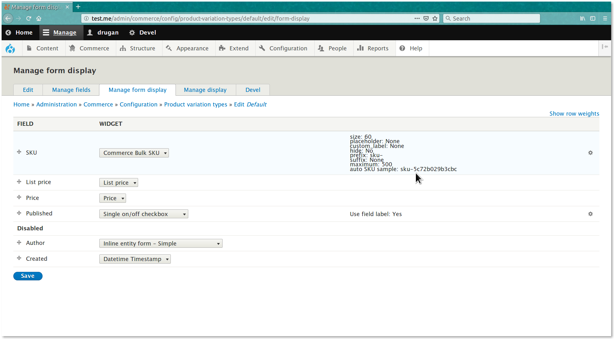

Commerce Bulk
=============

Provides a service for bulk creation of *Drupal Commerce* entities such
as *attribute values* and *variations*. Also, products can be bulk generated if
the [Commerce Generate ↗](https://github.com/drugan/commerce_bulk/tree/8.x-1.x/modules/commerce_generate)
submodule is enabled.

> Tip: you can see this file in your browser by clicking
the [admin/help#](#0 "? Help") link at the right of the *Admin toolbar* and then
the [admin/help/commerce_bulk#](#0 "Commerce Bulk") link in the list.

________________________________________________________________________________

- [Commerce Bulk on drupal.org ↗](https://www.drupal.org/project/commerce_bulk)
- [Commerce Bulk on github.com ↗](https://github.com/drugan/commerce_bulk)
- [admin/help/commerce_bulk#anonymize-orders](#anonymize-orders "Anonymize Orders")
- [admin/help/commerce_bulk#info-for-developers](#info-for-developers "Info for developers")
- [admin/help/commerce_bulk#todo](#todo "TODO")
- [admin/help/commerce_bulk#module-author](#module-author "Module author")

________________________________________________________________________________

## Bulk variation actions

After installing the module go to
a [product/1/variations#](#0 "product/NNN/variations") tab and manage your
variations using configurable *variation* actions which are self-explanatory and
easy to use. Other contrib modules can add their own actions.


________________________________________________________________________________

To set up an auto _SKU_ pattern used for `**Duplicate variation**` action just
press the `**Add variation**` button and then click on
the [admin/commerce/config/product-variation-types/default/edit/form-display#](#0
"Set up default SKU") link in the *SKU* field description.



The *SKU* widget settings' summary explained:

- **size:** The size of the *SKU* field on a variation add / edit form.
- **placeholder:** The text appearing inside the empty *SKU* field.
- **maximum:** The maximum of *SKU* values that might be generated in one go.
Use it to restrict the number of variations to create by pressing
the `Create N variations` button. So, to create the next portion of variations
the button should be pressed once more and more, etc..
- **custom_label:** Set a custom label for the field as the
default *"SKU"* text for the label might be seen as confusing by some people.
- **hide:** Whether to hide the *SKU* field on a variation add / edit form. Note
that, despite the field is not visible, a valid *SKU* value will be generated on
the backend for the field.
- **prefix:** The text automatically prepended to a *SKU* value.
- **suffix:** The text automatically appended to a *SKU* value.
- **auto SKU sample:** The sample of
the [unique SKU ↗](http://php.net/manual/en/function.uniqid.php) that will be
generated for the given product variation type.

________________________________________________________________________________

## Bulk attribute actions

Press an attribute `**Bulk**` operation button while on
the [admin/commerce/product-attributes#](#0 "Product attributes") page.


________________________________________________________________________________

## Bulk taxonomy term actions

Press an attribute `**Bulk**` operation button while on
the [admin/structure/taxonomy#](#0 "Taxonomy terms") page.


________________________________________________________________________________

Manage an _attribute values_ using configurable actions which are
self-explanatory and easy to use. Other contrib modules can add their own
actions.


________________________________________________________________________________

## Anonymize Orders

Select orders to anonymize on the [admin/commerce/orders#](#0 "Orders") page and
then select desirable fields on the action config form.


See an example how orders or any other entity type can be anonymized on a cron
job:

@PHPFILE: commerce_bulk.module LINE:182 PADD:22  :PHPFILE@

________________________________________________________________________________


## Info for developers

All the above functionality is based on the `**BulkVariationsCreator**` service
which you can use in your custom module. For example, let's say you want to
automatically create products with all possible or just a subset of
variations. It's easy, just see how the *Commerce Generate* `GenerateProducts`
plugin make it.

@PHPFILE: modules/commerce_generate/src/Plugin/DevelGenerate/GenerateProducts.php LINE:576 PADD:18 :PHPFILE@

________________________________________________________________________________

Also, see how the service is called in the `commerce_bulk.module` file.

@PHPFILE: commerce_bulk.module LINE:92 PADD:5  :PHPFILE@

________________________________________________________________________________

## TODO

- Apply mechanism to automatically add variation images based on a certain
criteria.
- Create variations in a batch process. [Example ↗](https://www.drupal.org/project/commerce/issues/2902882#comment-12486526)


###### Module author:
```
  Vlad Proshin (drugan)
  [proshins@gmail.com](proshins@gmail.com)
  [https://drupal.org/u/drugan](https://drupal.org/u/drugan)
```
