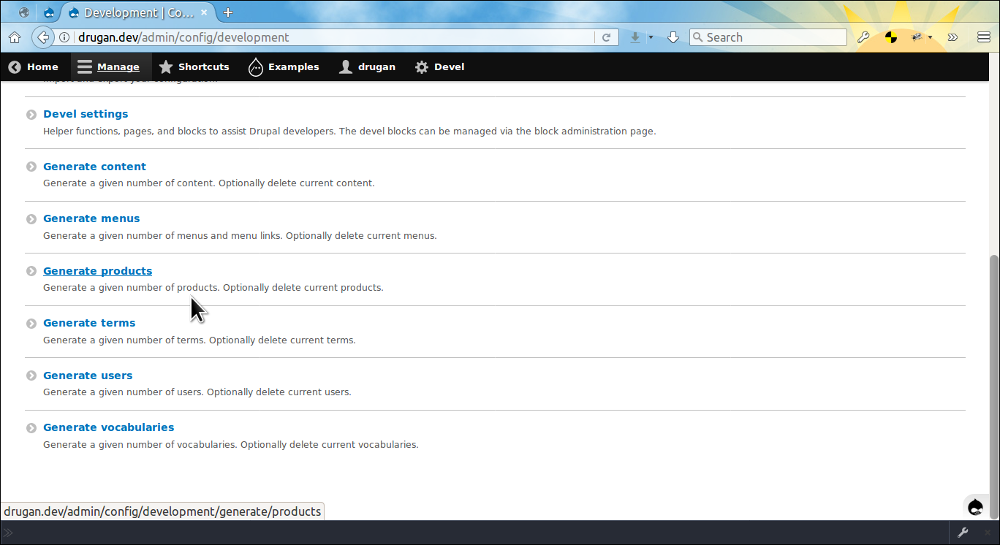
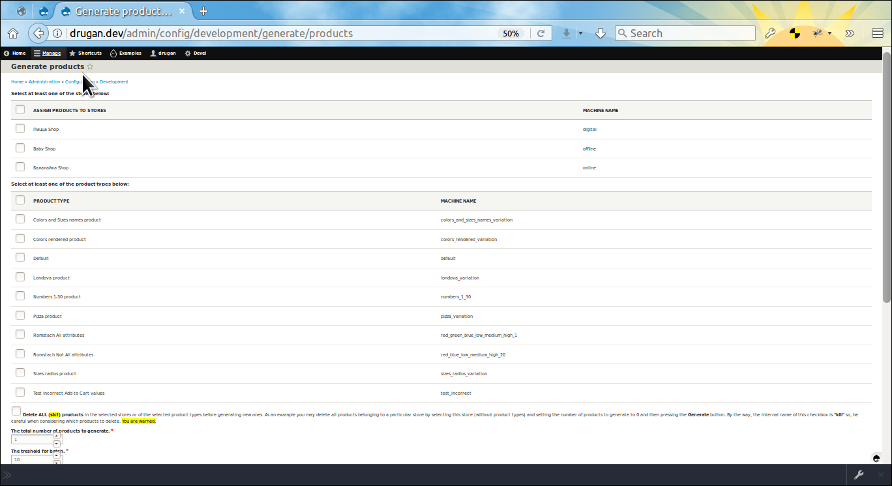
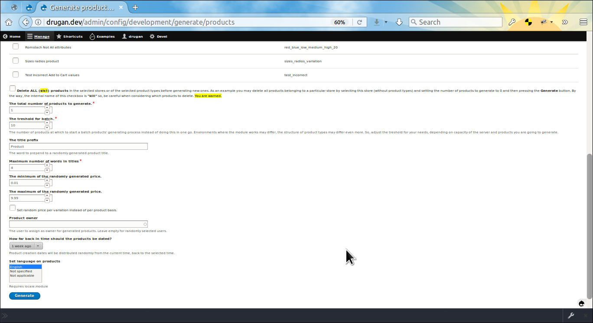
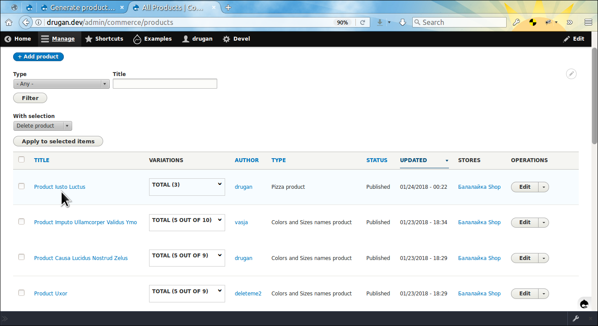
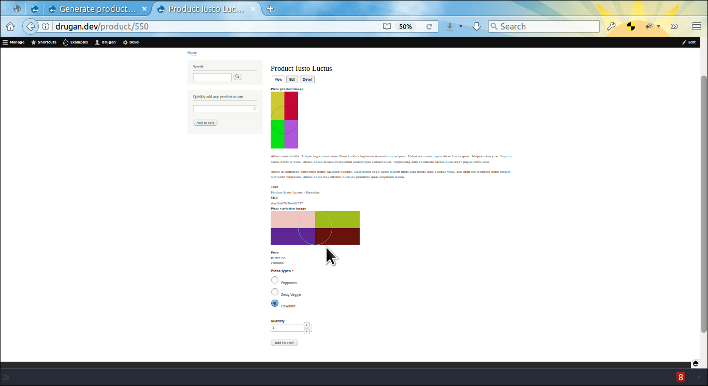
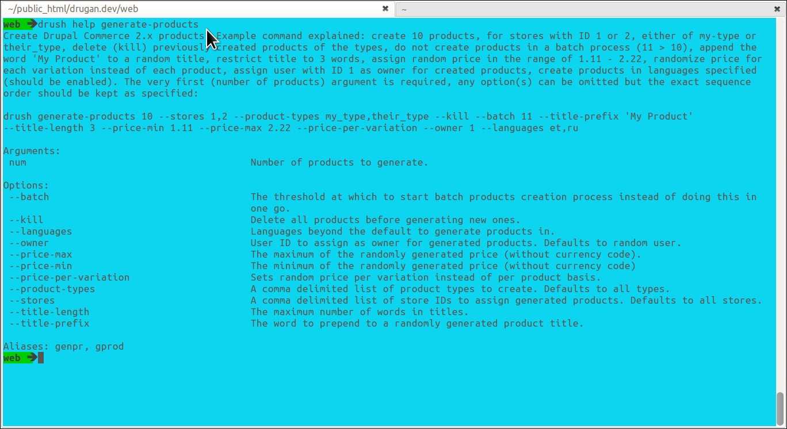

Commerce Generate
=================

Generates dummy commerce products. If you ever used *Generate content* plugin
then you might be familiar with the functionality because
the *Generate Products* is also plugin implementation of
the *Devel Generate* module.

- [admin/help/commerce_generate#todo](#todo "TODO")
- [admin/help/commerce_generate#module-author](#module-author "Module author")






________________________________________________________________________________

The products to generate might be configured.



________________________________________________________________________________



________________________________________________________________________________

The same as the parent module does the *Generate Products* also generates dummy
images both for the product itself as well as for each product variation if the
image field is added to a variation type.



________________________________________________________________________________

You may also use *Drush 8.x* command for generating products. As the command is
highly configurable it is recommended to look
into `drush help generate-products` before running it.



________________________________________________________________________________

For example, create 50 products using all existing stores and product types with
the following default values:

- **--kill FALSE**
- **--batch 10**
- **--title-prefix 'Product'**
- **--title-length 4**
- **--price-min 0.01**
- **--price-max 9.99**
- **--price-per-variation FALSE**
- **--owner RANDOM**
- **--languages SITE DEFAULT LANGUAGE**

```
drush generate-products 50
```

Or, use aliases of the command:

```
drush genpr 50
drush gprod 50
```

Note that because the number of products 50 is geater than `--batch 10` default
value, then the whole process will be run at the backend using batch API.
________________________________________________________________________________

Create 1 product for the store with ID *3*, of the
type `my_pizza_product_type` but first delete all products of this type which
were assigned to the store previously:

```
drush gprod 1 --stores 3 --product-types my_pizza_product_type --kill
```
________________________________________________________________________________

Delete all products of the
types `my_t_shirt_product_type` and `my_jeans_product_type`:

```
drush genpr 0 --product-types my_t_shirt_product_type,my_jeans_product_type --kill
```
Note that there is should not be space between comma separated option values.
________________________________________________________________________________


Delete all products of any type assigned to the store with ID *2*:

```
drush genpr 0 --stores 2 --kill
```
________________________________________________________________________________

The newly generated products might be altered by implementing
the `hook_ENTITY_TYPE_insert()` in your custom module.

@PHPFILE: commerce_generate.module LINE:17 PADD:6 :PHPFILE@

________________________________________________________________________________


## TODO

- *Generate Products* Drush 9.x command.
- *Generate Stores* plugin based on existing store types with dummy store
owner data.
- *Generate Product Types* plugin with randomly assigned product variation type.
- *Generate Product Variation Types* plugin with randomly constructed sets of
attributes.
- *Generate Attributes* plugin to generate dummy attributes with some predefined
sets of values such as colors, sizes, human names, animals, numbers
like *One*, *Two*, *Three* or *1*, *2*, *3*, etc..
- `Add sample store` button on the [admin/commerce/config/stores#](#0
"admin/commerce/config/stores") page.
- `Add sample product` button on the [admin/commerce/config/product-types#](#0
"admin/commerce/config/product-types") page.
- `Add sample product variation type` button on
the [admin/commerce/config/product-variation-types#](#0
"admin/commerce/config/product-variation-types") page.
- `Add sample product attribute` button on the [admin/commerce/product-attributes#](#0
"admin/commerce/product-attributes") page.

________________________________________________________________________________

###### Module author:
```
  Vlad Proshin (drugan)
  [proshins@gmail.com](proshins@gmail.com)
  [https://drupal.org/u/drugan](https://drupal.org/u/drugan)
```
